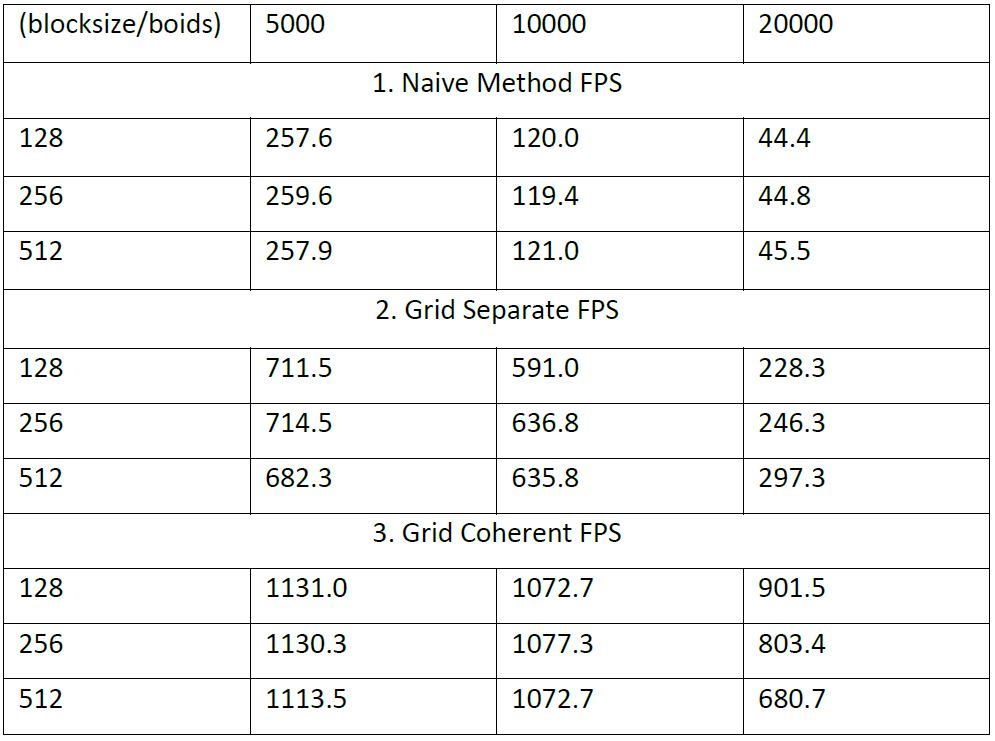
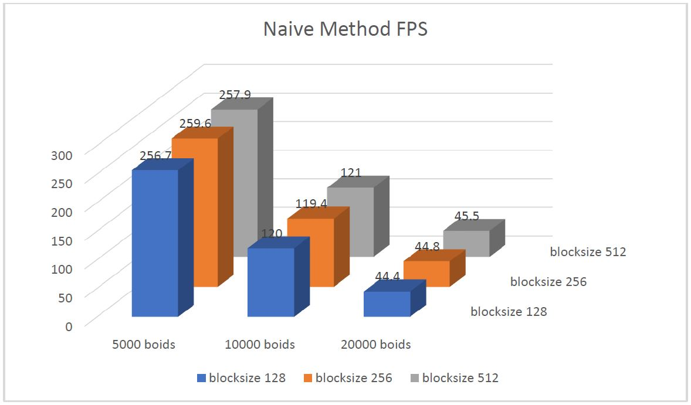
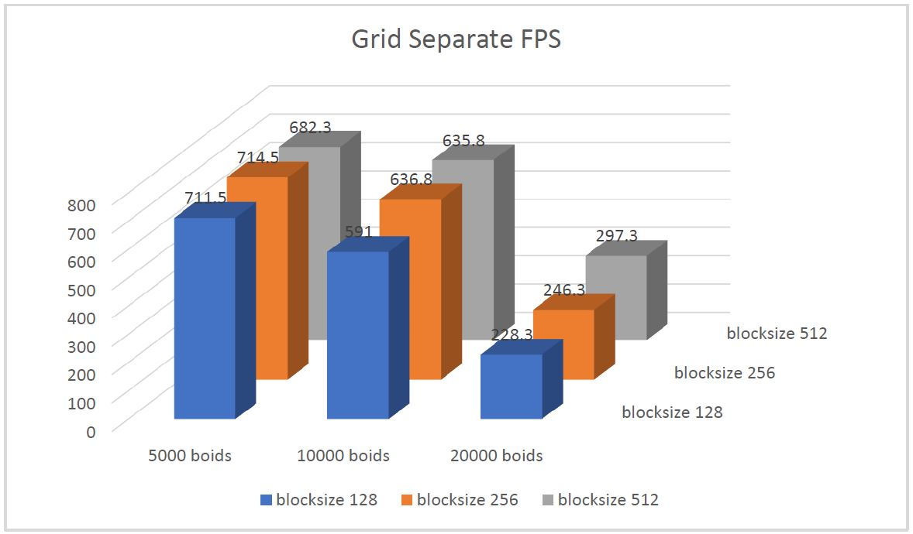
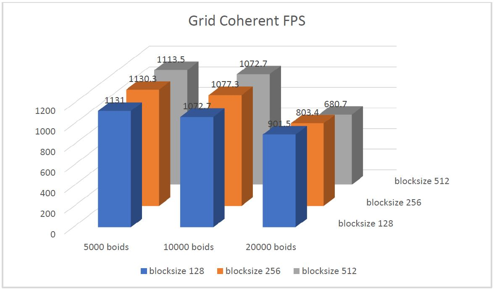
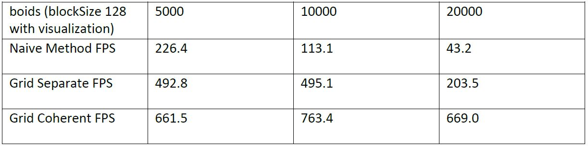
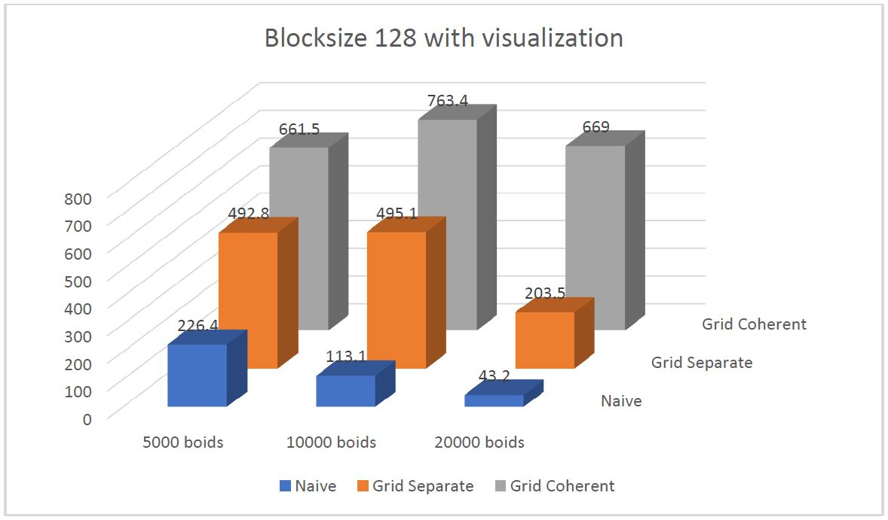

**University of Pennsylvania, CIS 565: GPU Programming and Architecture,
Project 1 - Flocking**

* Xiao Zhang
  * [LinkedIn](https://www.linkedin.com/in/xiao-zhang-674bb8148/)
* Tested on: Windows 10, i7-7700K @ 4.20GHz 16.0GB, GTX 1080 15.96GB (my own PC)

### Screenshot

The simulation for the screenshot is using uniform grid with coherent storage of position and velocity. There are 20000 boids being simulated and the blocksize for CUDA is set to 128. Vertical synchronization is turned on.

### Analysis

## The chart below shows the framerate under different blocksize and boids number configuration of all 3 simulation methods.

## The graph below shows the framerate under different blocksize and boids number configuration of the naive simulation method.

## The graph below shows the framerate under different blocksize and boids number configuration of the uniform grid simulation method with separate memory storage for position and velocity.

## The graph below shows the framerate under different blocksize and boids number configuration of the uniform grid simulation method with coherent memory storage for position and velocity.

## The chart below shows the framerate under different boids number configuration of all 3 simulation methods when visualization is turned on and CUDA blocksize is set to 128.

## The graph below shows the chart above.

### Q&A

* For each implementation, how does changing the number of boids affect performance? Why do you think this is?

Increasing the number of boids lower the framerate. This is mainly because there are more data being transfered between GPU and CPU in one frame. Because according to the analysis, framerate doesn't increase when blocksize is larger, which means parallelization is not the problem and every boid is running on their own thread. So the next most possible reason is data throughput.

* For each implementation, how does changing the block count and block size affect performance? Why do you think this is?

Changing block count and block size hardly affects the performance. This is because the way we are assigning the workload will always assure that every boid will run on their own thread. When we have small block size, the block count will increase to assure that everything still finish in one grid.

* For the coherent uniform grid: did you experience any performance improvements with the more coherent uniform grid? Was this the outcome you expected? Why or why not?

Yes. Yes. Because instead of accessing position and velocity in a separated manner for multiple times, we are using one grid to reshuffle the position and velocity so that we can access them in a coherent manner later. In this reshuffle process, we are still accessing position and velocity in a separated manner, but we only need to do this once. After reshufling them, we can access them more efficiently, because the GPU cache and the principle of locality.

* Did changing cell width and checking 27 vs 8 neighboring cells affect performance? Why or why not? Be careful: it is insufficient (and possibly incorrect) to say that 27-cell is slower simply because there are more cells to check!

Not significantly. First, yes, it will affect performance, because there are more cells to check, which means potentially more boids to account for, and the process is not parallelized. But on the other hand, this means each thread has more chance to have equal amount of work to do (extreme case being all boids checking all cells, which is basically the naive method). On GPU, this is a good sign because the same warp will always wait for the slowest to finish, therefore having a balanced workload for each thread will improve performance.
